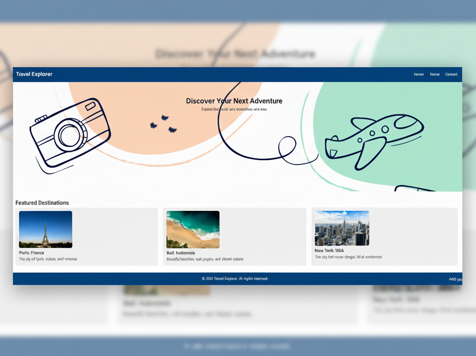

# ✈️ Travel Explorer Website

A clean, modern, and responsive static website designed to showcase beautiful travel destinations. Built with pure HTML and CSS, this project is perfect for a web development portfolio.


## 🚀 Live Demo
**👉 [View Live Website](https://jaydipmodasiya.github.io/travel-website/)**

## ✨ Features

*   **Fully Responsive Design**: Looks great on all devices, from desktop to mobile.
*   **Modern & Clean UI**: Features a visually appealing layout with a focused color scheme.
*   **Fast Loading**: Built with static HTML/CSS for optimal performance.
*   **Easy to Customize**: Simple, well-structured code makes it easy to add new destinations or change styles.
*   **Hosted on GitHub Pages**: Free and reliable hosting directly from the GitHub repository.

## 🗂️ Project Structure

```
travel-website/
│
├── index.html          # Main HTML file
├── README.md           # This documentation file
│
├── assets/             # Folder for static assets
│   └── css/            # Stylesheets folder
│       └── style.css   # Main CSS file
│   
├── images/         # Folder for all images (hero, destinations, etc.)
│      ├── banner.jpg  # Hero/header image
│      ├── paris.jpg   # Image for Paris destination
│      ├── bali.jpg    # Image for Bali destination
│      └── newyork.jpg # Image for New York destination
```

## 🛠️ Technologies Used

*   **HTML5**: For the semantic structure of the website.
*   **CSS3**: For styling, layout (Flexbox/Grid), and responsiveness.
*   **Git & GitHub**: For version control and deployment.
*   **GitHub Pages**: For free static site hosting.

## 📦 How to Use / Setup Locally

Want to run this project on your own computer? Follow these simple steps:

1.  **Clone the repository**:
    ```bash
    git clone https://github.com/jaydipmodasiya/travel-website.git
    ```

2.  **Navigate to the project folder**:
    ```bash
    cd travel-website
    ```

3.  **Open the `index.html` file** in your favorite web browser (like Chrome, Firefox, or Edge). You can simply double-click the file.

That's it! No complex builds or installations are needed.

## 🎨 Customization Guide

You can easily modify this website to make it your own:

*   **Change Content**: Edit the text and images in `index.html`.
*   **Update Styles**: Modify colors, fonts, and layouts in `assets/css/style.css`.
*   **Add New Destinations**: Duplicate one of the existing destination sections in `index.html` and update the text and image path.
*   **Replace Images**: Add your own high-quality images to the `assets/images/` folder and update the `src` attributes in the HTML.

## 📸 Preview

 

*Homepage featuring a hero banner and featured destination cards for Paris, Bali, and New York.*

## 🧠 What I Learned / Practiced

Building this project helped solidify my understanding of:
*   Creating a responsive layout from scratch.
*   Structuring HTML with semantic tags.
*   Writing maintainable and organized CSS.
*   The workflow of deploying a static site to **GitHub Pages**.

## 🤝 Contributing

Contributions, issues, and feature requests are welcome! Feel free to check the [issues page](#) (if you create one) or submit a Pull Request.

## 👨‍💻 Author

**Jaydip Modasiya**

*   GitHub: [@jaydipmodasiya](https://github.com/jaydipmodasiya)
*   This Project: [Travel Explorer](https://github.com/jaydipmodasiya/travel-website)

## 📄 License

This project is licensed under the **MIT License**. See the `LICENSE` file for details.

---

### ⭐ If you found this project helpful, don't forget to give it a star on GitHub!